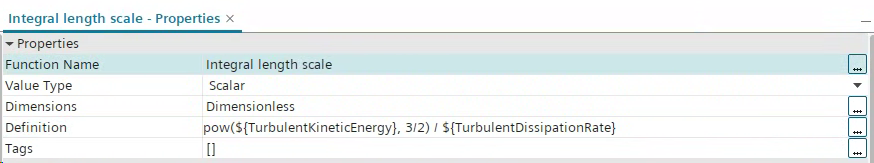
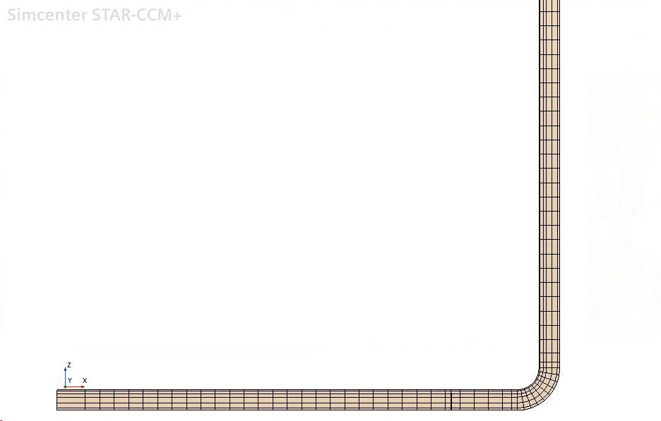
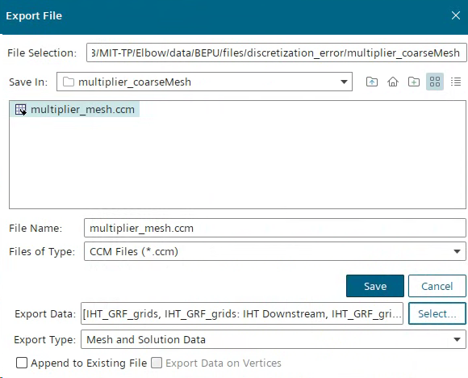
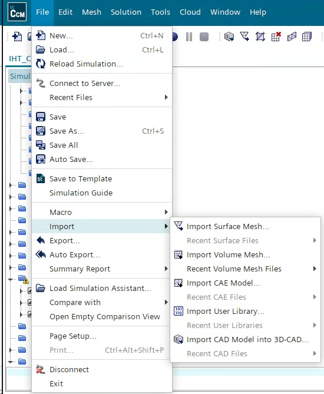
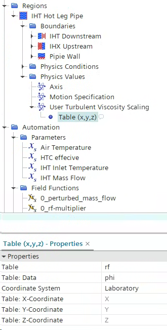

# Demo: Elbow

## 1. Initialize the folder Template
- Copy the `templates` folder to the main UQ directory, rename it as `files`

```bash
files
├── config
│   └── template_uq_config.yaml
├── discretization_error
│   ├── h1
│   ├── h2
│   ├── h3
│   ├── h4
│   └── template_least_square_config.yaml
├── input_error
│   └── template_input_error_config.yaml
├── java
│   └── template_java.java
├── model_error
├── sim
│   └── rf.csv
└── slurm
    ├── engaging.slurm
    └── template_job_submission_script.slurm

```

## 2. Sim file

- Put the baseline in the `files/sim`  
- Implement the turbulence integral length scale as a field function. 
	- $L_0 = \tau_m \sqrt{k_m}$
		- $\tau_m$:  modeled turbulence time scale 
		- $k_m$: modeled turbulence kinetic energy
- Model implementation: 
	- $k-\epsilon$ model : $L_0 = k_m^{3/2}/\epsilon_m$ 
	- $k-\omega$ model (and SST):  $L_0 = \sqrt{k_m}/(C_\mu \omega_m)$, $C_\mu=0.09$
- For k-epsilon model:  

  <div style="background-color: white; padding: 10px; display: inline-block;">
    
  </div>


<br>

## Grid convergence Study

- Perform mesh convergence study, and save the results to the `files/discretization_error`

```
files/discretization_error
├── h1
│   └── IHT_rke_RANS_12p5mm@03000.sim
├── h2
│   └── IHT_rke_RANS_25mm@03000.sim
├── h3
│   └── IHT_rke_RANS_50mm@03000.sim
└── h4
│   └── IHT_rke_RANS_75mm@03000.sim
│   └── multiplier_mesh.ccm
└── template_least_square_config.yaml

```


## Define GRF grids and extract $L_0$
- Create another sim file with coarse mesh, named  
	- Turn off wall prism layer
	- Increase base size
	- Reduce number of layers 

  <div style="background-color: white; padding: 10px; display: inline-block;">
    
  </div>

- Export the grf mesh as ccm file
  <div style="background-color: white; padding: 10px; display: inline-block;">
    
  </div>

### Extract $L_0$
  - Import the ccm file as volume mesh, it will crate a new region, rename it as `GRF_mesh`
  <div style="background-color: white; padding: 10px; display: inline-block;">
    
  </div>


- Create another sim file with coarse mesh, named  
	- Turn off wall prism layer
	- Increase base size
	- Reduce number of layers 
### Data mapper 
- Create a data mapper:  `Tools > Data Mapper (right click) > New Data Mapper >Volume Data Mapper`
	- Source Volume: the original region (**IHT Hot Leg Pipe** in this case)
	- Scalar Functions: choose **Integral length scale**
	- Target Volume: the **GRF_mesh**
	- Source / Target Stencil: **Cell***
- Right click, choose `Map Data`
	- It creates a field function called **MappedIntegral length scale**
- Create an XYZ internal table to extract data: 
	- Scalars: **MappedIntegral length scale** 
	- Parts: **GRF_mesh**
- Export the table and save 
  - Note! It must be SI unit!

  The resulting file structure 

```
files/discretization_error
├── h1
│   ├── extract_L0.java
│   ├── IHT_rke_RANS_12p5mm@03000.sim
│   ├── ils.csv
│   └── multiplier_mesh.ccm
├── h2
│   ├── IHT_rke_RANS_25mm@03000.sim
│   ├── ils.csv
│   └── multiplier_mesh.ccm
├── h3
│   ├── IHT_rke_RANS_50mm@03000.sim
│   ├── ils.csv
│   └── multiplier_mesh.ccm
├── h4
│   ├── IHT_rke_RANS_75mm@03000.sim
│   ├── ils.csv
│   └── multiplier_mesh.ccm
└── template_least_square_config.yaml

```


## Numerical error estimation
See [processor_leastSquare](api/processor_leastSquare.md)
```yaml
paths:
  root:  '/mnt/research_3TB/MIT-TP/Elbow-Demo_v2/files/discretization_error/'

ls:
  field_name: 'MappedIntegral length scale'
  save_to:  '/mnt/research_3TB/MIT-TP/Elbow-Demo_v2/files/discretization_error/ls'

grids:
  grid_1:
    name: 'grid1'
    dir: '/mnt/research_3TB/MIT-TP/Elbow-Demo_v2/files/discretization_error/h1'
    N: 7206400
    V: 16.911  
    field_file_name: 'ils.csv'

  grid_2:
    name: 'grid2'
    dir: '/mnt/research_3TB/MIT-TP/Elbow-Demo_v2/files/discretization_error/h2'
    N: 1320000
    V: 16.911 
    field_file_name: 'ils.csv'

  grid_3:
    name: 'grid3'
    dir: '/mnt/research_3TB/MIT-TP/Elbow-Demo_v2/files/discretization_error/h3'
    N: 267200
    V: 16.911  
    field_file_name: 'ils.csv'

  grid_4:
    name: 'grid4'
    dir: '/mnt/research_3TB/MIT-TP/Elbow-Demo_v2/files/discretization_error/h4'
    N: 149700
    V: 16.911  
    field_file_name: 'ils.csv'

points: 
  start: 0
  end: 3679
```


## Input error latin-hypercube sampling (LHS)
See [processor_BEPU_sampling](api/processor_BEPU_sampling.md)
```yaml

path:
  save_to: '/mnt/research_3TB/MIT-TP/Elbow-Demo_v2/files/input_error/lhs_samples.csv'

input_error:
  IHT_MASSFLOW:
    mean: 1
    std: 0.02

model_error:
  N_modes: 20

```


## Prepare java 
```java
// Simcenter STAR-CCM+ macro: elbow_input.java
// Written by Simcenter STAR-CCM+ 19.04.009
package macro;

import java.util.*;

import star.common.*;
import star.base.neo.*;
import star.turbulence.*;


public class my_java extends StarMacro {

  public void execute() {
    change_IC();
    turn_on_viscosity_perturbation();
    run();
    collect_data();
  }

  private void change_IC() {

    Simulation simulation_0 = 
      getActiveSimulation();

    /* ==================================================
        Customize: perturb through field functions 
     =================================================*/
    UserFieldFunction userFieldFunction_0 = 
    ((UserFieldFunction) simulation_0.getFieldFunctionManager().getFunction("0_perturbed_mass_flow"));
    userFieldFunction_0.setDefinition("${IHT Mass Flow} * IHT_MASSFLOW");


  }
  
  private void turn_on_viscosity_perturbation() {

    Simulation simulation_0 = 
      getActiveSimulation();

    // Turn on the user eddy viscosity scaling
    Region region_0 = 
      simulation_0.getRegionManager().getRegion("IHT Hot Leg Pipe"); // Change to your region name

    TurbulentViscosityUserScalingProfile turbulentViscosityUserScalingProfile_0 = 
      region_0.getValues().get(TurbulentViscosityUserScalingProfile.class);

    //Set the user scaling method as xyz table 
    turbulentViscosityUserScalingProfile_0.setMethod(XyzTabularScalarProfileMethod.class);

    // Set table "rf.csv"
    FileTable fileTable_1 = 
      ((FileTable) simulation_0.getTableManager().getTable("rf"));
    turbulentViscosityUserScalingProfile_0.getMethod(XyzTabularScalarProfileMethod.class).setTable(fileTable_1);
    // Use the value "phi"
    turbulentViscosityUserScalingProfile_0.getMethod(XyzTabularScalarProfileMethod.class).setData("phi");
    
    // Reload the rf.csv
    FileTable fileTable_0 = 
      ((FileTable) simulation_0.getTableManager().getTable("rf"));
    fileTable_0.extract();
  }
  
  private void run() {

    Simulation simulation_0 = 
      getActiveSimulation();
      
    // Set Stopping Criteria
    StepStoppingCriterion stepStoppingCriterion_0 = 
      ((StepStoppingCriterion) simulation_0.getSolverStoppingCriterionManager().getSolverStoppingCriterion("Maximum Steps"));

    IntegerValue integerValue_0 = 
      stepStoppingCriterion_0.getMaximumNumberStepsObject();

    integerValue_0.getQuantity().setValue(MAXITER);


   // Clean solution history
    Solution solution_0 = 
      simulation_0.getSolution();

    solution_0.clearSolution(Solution.Clear.History);

    // Run
    simulation_0.getSimulationIterator().run();

  }
  
  private void collect_data() {

    Simulation simulation_0 = 
      getActiveSimulation();

    XYPlot xYPlot_0 = 
      ((XYPlot) simulation_0.getPlotManager().getPlot("Horizontal Temperature Stratification"));

    xYPlot_0.export("T_h.csv", ",");

    XYPlot xYPlot_1 = 
      ((XYPlot) simulation_0.getPlotManager().getPlot("Horizontal Velocity"));

    xYPlot_1.export("V_h.csv", ",");

    XYPlot xYPlot_2 = 
      ((XYPlot) simulation_0.getPlotManager().getPlot("Vertical Velocity"));

    xYPlot_2.export("V_v.csv", ",");

    MonitorPlot monitorPlot_0 = 
      ((MonitorPlot) simulation_0.getPlotManager().getPlot("Wall Heat Loss  Plot"));

    monitorPlot_0.export("q.csv", ",");
  }


}
```


## Copy sim and prepare model_error
- Select the baseline sim file, say `files/discretization_error/h2/IHT_rke_RANS_25mm@0300.sim`
	- Put it in `files/sim`
- Model_error:
	- Put the ils file of the baseline sim `files/discretization_error/h2/ils.csv` to the `files/model_error` directory

### implement the $\mu_t$ perturbation
- The perturbation of $\mu_t$ is  achieved by **Turbulent Viscosity User Scaling** model
- We will generate `rf.csv`  files as (x,y,z table )to perturb  $\mu_t$

  <div style="background-color: white; padding: 10px; display: inline-block;">
    
  </div>


- So now we create a dummy csv as a place holder:
	- In the `files/sim` folder, there is an empty `rf.csv`
	- Read the `rf.csv`  as a table, which is a place-holder
- Initial setting; 
	- Set the `Regions > Physics values > User Turbulent Viscosity Scaling` using  constant = 1 (no perturbation) 
	- When doing UQ, we will use java to ask it to read `rf.csv`

- Behind the scene: 
  - When running simulation, the java (see above) turn on the User Turbulent Viscosity Scaling and reload `rf.csv`


## Slurm

This is for my local machine
```
#!/bin/bash

# 1. Execute python
source ~/anaconda3/etc/profile.d/conda.sh 
conda activate
python grf.py


# 2. Execute STARCCM+

# Specify the STARCCM path
starccm19="/opt/Siemens/19.04.009-R8/STAR-CCM+19.04.009-R8/star/bin/starccm+"
rm -f DONE
rm -f ABORT
sim_file="SIM_FILE_NAME" # same as baseline sim specified by uq_config.yaml. will be replaced by job_manager
n_prcs=N_CORES # specified in uq_config.yaml. will be replaced by job_manager

# Search for the java file in the same folder
java_file=$(find . -maxdepth 1 -type f -name "*.java" -printf "%T@ %p\n" | sort -nr | head -n 1 | cut -d' ' -f2-)

if [ -z "$java_file" ]; then
    echo "ERROR: No .java file found in current directory."
    touch ABORT
    exit 1
fi

echo "Using newest Java macro: $java_file"
$starccm19  $sim_file -batch $java_file -np $n_prcs | tee -a log


touch DONE
```

This is for the HPC
```
#!/bin/bash
module load anaconda3/2022.10
env
cpus="$SLURM_CPUS_ON_NODE"
nodelistcompact="$SLURM_JOB_NODELIST"
nodelistfull=`scontrol show hostnames $nodelistcompact`
nodes=`echo $nodelistfull | sed 's/$/ /g' | sed 's/ /:32,/g'`
n_prcs=`echo $nodelistfull | sed 's/$/ /g' | sed 's/ /:'"$cpus,"'/g'`
host=`echo $nodelistfull | sed 's/$/ /g'`


echo --------
echo $n_prcs
echo -------

echo --------
echo $nodelistfull
echo -------


hostname="$HOSTNAME"


# 1 . Execute python
python grf.py


# 2. Execute Star

sim_file="SIM_FILE_NAME"
# Search for the java file in the same folder
java_file=$(find . -maxdepth 1 -type f -name "*.java" -printf "%T@ %p\n" | sort -nr | head -n 1 | cut -d' ' -f2-)

if [ -z "$java_file" ]; then
    echo "ERROR: No .java file found in current directory."
    touch ABORT
    exit 1
fi
echo "Using newest Java macro: $java_file"


# version="/home/yjouwang/18.02.008-R8/STAR-CCM+18.02.008-R8"
version="/home/rbrew/STAR-CCM+/19.04.009-R8/STAR-CCM+19.04.009-R8"

rm -f DONE
rm -f ABORT

${version}/star/bin/starccm+  $sim_file -printpids -batch -rsh ssh $java_file -on $n_prcs | tee -a log

touch DONE
```

Note: since the local machine and remote HPC takes different argument.
Create your class for  the `driver/src/job_manager.py`:

```python 
class JobManager:
    """ A class to manage the job submission. 
    The class should be inherited and the run method should be implemented.
    Subclasss should implement prepare_files and run methods.
    """
    def __init__(self):
        pass

    def prepare_files(self):
        raise NotImplementedError

    def run(self):
        raise NotImplementedError
```
Two example classes are in the same file.


Once your job manager is defined, use it in `driver/driver.py`:

```python

# !! Import your job manager
from src.job_manager import YourJobManager

...

if __name__ == "__main__":
    if len(sys.argv) != 2:
        print("Usage: python driver_uq.py path/to/config.yaml")
        sys.exit(1)
    CONFIG_PATH = sys.argv[1]

    config = read_config_from_yaml(CONFIG_PATH)
    SAMPLE_LIST = parse_sample_list(config['rf']['sample_list'])
    path_config = {
        'root':config['path']['root'],
        'base_sim_filepath':config['path']['base_sim_filepath'],
        'bepu_input_path':config['path']['bepu_input_path'],
        'ils_filepath':config['path']['ils_filepath']
    }

    ...

    # !! Use your job manager
    job_manager = YourJobManager(
        slurm_filepath = config['job']['slurm_filepath'],  
        partition=config['job']['partition'],
        time_for_nodes=config['job']['time_for_nodes'],
        n_nodes=config['job']['n_nodes'],
        n_cores=config['job']['n_cores'],
        interactive_mode = config['job']['interactive_mode'], 
        rerun = config['job']['rerun']
    )
    ...

```


## Config
Finally, `uq_config.yaml` connects everything together

```yaml
path:
  root: '/mnt/research_3TB/MIT-TP/Elbow-Demo_v2/results_UQ_noNumError'
  base_sim_filepath: '/mnt/research_3TB/MIT-TP/Elbow-Demo_v2/files/sim/IHT_rke_RANS_25mm_base.sim'
  ils_filepath:  '/mnt/research_3TB/MIT-TP/Elbow-Demo_v2/files/model_error/ils.csv'
  de_folderpath: '/mnt/research_3TB/MIT-TP/Elbow-Demo_v2/files/discretization_error/ls/U_1' 
  bepu_input_path: '/mnt/research_3TB/MIT-TP/Elbow-Demo_v2/files/input_error/lhs_samples.csv'

job:
  slurm_filepath: '/mnt/research_3TB/MIT-TP/Elbow-Demo_v2/files/slurm/my_job_submission_script.slurm'
  partition: None # local: None, remote: 'partition_name'
  time_for_nodes: None # local: None, remote: 'hh:mm:ss'
  n_nodes: None # local: None, remote: number of nodes to request
  n_cores: 1 # number of cores
  interactive_mode: False
  rerun: True

java:
  java_filepath: ['/mnt/research_3TB/MIT-TP/Elbow-Demo_v2/files/java/my_java.java']
  java_keywords: {
    "MAXITER": "5000",
  }

rf:
  sample_list: range(20)
  target_quantity: MappedIntegral length scale
  k_l0: 1.22
  s_2: 1.24
  n_trunc: 20
  n_modes: 3569
  save_every_rf: False
  model_error_on: True
  disc_error_on: False


```

## Run
```bash
cd driver
python driver_uq.py path/to/config.yaml
```