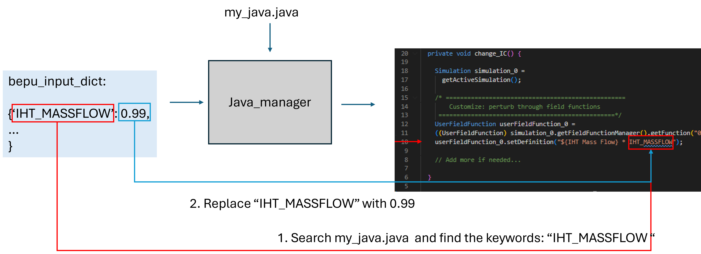

# Driver API

The driver module orchestrates end-to-end UQ runs: setting up sample folders, preparing simulation files, generating random fields, and submitting jobs.


## Workflow 
The UQ script will need following files:

```
your_working_directory
├── config
│   └── my_uq_config.yaml 
├── discretization_error # Done in step 2
│   ├── my_least_square_config.yaml
│   ├── h1
│   │   └── ils.csv
│   ├── h2
│   │   └── ils.csv
│   ├── h3
│   │   └── ils.csv
│   ├── h4
│   │   └── ils.csv
│   └── ls  
│       ├── U_0
│       │   └── U.csv
│       ├── U_1
│       │   └── U.csv
│       ├── U_2
│       │   └── U.csv
│       └── U_3
│           └── U.csv
├── input_error  # Done in step 1
│   ├── lhs_samples.csv # <- Generated by step 1
│   └── my_input_error_config.yaml
├── java
│   └── my_java.java
├── model_error
│   └── ils.csv # correspond to the baseline.sim
├── sim
│   ├── basline.sim  
│   └── rf.csv # dummy file; no need to touch it 
└── slurm
    └── my_job_submission_script.slurm # control how starccm is called and ran

```


When running :
```bash
cd driver
python driver_uq.py path/to/uq_config.yaml
```


This creates UQ file structure look like: 

```
root
├── 0                             # Case id
│   ├── baseline.sim              # baseline sim file
│   ├── my_java.java              # STAR-CCM+ macro
│   ├── my_slurm.slrum            # job and resource control 
│   ├── grf.py                    # python module to generate random file: this file reads: 
│   ├── ils.csv                   #     ils.csv: use it to guide the Gaussian random field  
│   ├── rf_dict.json              #     rf_dict.json: information for random field 
│   └── bepu_input_dict.json      #     bepu_input_dict.json: contains random coefficients 
├── 1
│   ├── baseline.sim
│   ├── my_java.java
│   ├── my_slurm.slrum
│   ├── grf.py
│   ├── ils.csv
│   ├── rf_dict.json
│   └── bepu_input_dict.json
...

```


And the `driver_uq.py` enters each sub-directory, submit `my_slurm.slurm` to run the simulation.


## Slurm 
The slurm/shell controls the computing nodes / local machine to execute 2 jobs:
1. Execute python: generate Gaussian Random Field as csv file
2. Execute STAR-CCM+: run the simulation of the sample


The template `files/slurm/template_job_submission_script.slurm` is attached as a reference: 

### Example slurm
The slurm/shell script is machine-dependent. This is an example of my local linux machine

```bash
#!/bin/bash

# 1. Execute python
source ~/anaconda3/etc/profile.d/conda.sh 
conda activate
python grf.py


# 2. Execute STARCCM+

# Specify the STARCCM path
starccm19="/opt/Siemens/19.04.009-R8/STAR-CCM+19.04.009-R8/star/bin/starccm+"
rm -f DONE
rm -f ABORT
sim_file="SIM_FILE_NAME" # same as baseline sim specified by uq_config.yaml. will be replaced by job_manager
n_prcs=N_CORES_FOR_COMPUTING # specified in uq_config.yaml. will be replaced by job_manager

# Search for the java file in the same folder
java_file=$(find . -maxdepth 1 -type f -name "*.java" -printf "%T@ %p\n" | sort -nr | head -n 1 | cut -d' ' -f2-)

if [ -z "$java_file" ]; then
    echo "ERROR: No .java file found in current directory."
    touch ABORT
    exit 1
fi

echo "Using newest Java macro: $java_file"
$starccm19  $sim_file -batch $java_file -np $n_prcs | tee -a log


touch DONE
```
### Behind the scene of the slurm file:
  <div style="background-color: white; padding: 10px; display: inline-block;">
    
  </div>


  <div style="background-color: white; padding: 10px; display: inline-block;">
    
  </div>


## Java 
Java macro is used for control STAR-CCM+. 

When running the star, the java macro: 
```
- Change Input parameter: using field function 
- Turn on the eddy viscosity user scaling model and reload rf.csv
- Run 
```
The template is in `files/java/template_java.java`.
When customize it, **PUT KEYWORDS AS PLACEHOLDERS**. **THE KEYWORDS SHOULD BE THE SAME AS THE ONES DEFINED IN** `files/input_error/my_input_error_config.yaml`. 

One example is: 

```java 
public class template_java extends StarMacro {

  public void execute() {
    change_IC(); // customize this function
    turn_on_viscosity_perturbation(); // leave it as it is 
    run(); // leave it as it is
  }

  private void change_IC() {

    Simulation simulation_0 = 
      getActiveSimulation();

    /* ==================================================
        Customize: perturb through field functions 
     =================================================*/
    UserFieldFunction userFieldFunction_0 = 
    ((UserFieldFunction) simulation_0.getFieldFunctionManager().getFunction("0_perturbed_mass_flow"));
    userFieldFunction_0.setDefinition("${IHT Mass Flow} * IHT_MASSFLOW"); //--> IHT_MASSFLOW is the place holder

    // Add more if needed...

  }
```


### Behind the scene: java manager
  <div style="background-color: white; padding: 10px; display: inline-block;">
    
  </div>


Note
- We left the same mechanism for extra control from `uq_config.yaml`(see below). The java manager search for `(key, value)` pairs in `java_keywords` node. It is useful to control the stopping criteria. Just remember to **LEAVE A KEYWORD PLACEHOLDER** in the java file. 


## config
All the files in the UQ-subfolders (i.e., directory `0`, `1`, `2`...) are handled by the `driver_uq.py`, which reads the `my_uq_config.yaml` file and initiate: 
-  `job_manager`: controls the resource and job submission
-  `rf_manager`: controls the random field module
-  `java_manager`: takes care of the STAR-CCM+ java macro


The tempalte for `my_uq_config.yaml` can be found in `Template/config/template_uq_config.yaml`


```yaml

path: # <- Specify the paths of the files
  root: '/path/to/uq_results'
  base_sim_filepath: 'working_dir/files/sim/baseline.sim'
  ils_filepath:  'working_dir/files/model_error/ils.csv'
  de_folderpath: 'working_dir/files/discretization_error/ls/U_1' 
  bepu_input_path: 'working_dir/files/input_error/lhs_samples.csv'

job: # <- Control the job and resource  
  slurm_filepath: 'working_dir/files/slurm/my_job_submission_script.slurm'
  partition: None # local: None, remote: 'partition_name'
  time_for_nodes: None # local: None, remote: 'hh:mm:ss'
  n_nodes: None # local: None, remote: number of nodes to request
  n_cores: 6 # number of cores
  interactive_mode: False
  rerun: True

java: # the java 
  java_filepath: ['working_dir/files/java/my_java.java'] # it is a list: can be run in more than one java 
  java_keywords: {  # search for the keys, and replace with the values. See the Java section below
    "MAXITER": "1000",
    "SOME_NAME_TO_BE_REPLACED": "value_to_replace",
  }

rf: # control the random field
  sample_list: range(5) # Sample ID. Can be [1, 2, 3, 4, 5], or range(5), or range(5, 10)
  target_quantity: Integral length scale 
  k_l0: 1.22
  s_2: 1.24
  n_trunc: 20
  n_modes: 3569
  save_every_rf: False
  model_error_on: True
  disc_error_on: True


```


