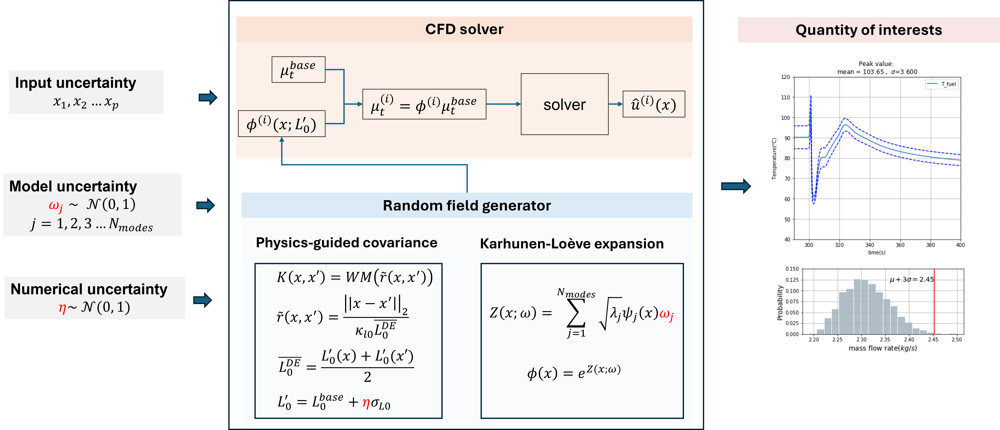

# LHS Sampling API

Generates Latin Hypercube Samples (LHS) for uncertain input parameters (e.g. mass flow, inlet temperature, material properties) plus mode coefficients (`XI_0`, `XI_1`, ...) and a discretization error random variable (`DEVAR`).

### Usage

```bash
cd preprocessor/inputlhsGen
python processor_BEPU_sampling.py path/to/input/config.yaml
```

### Config format
Create a yaml file for input error. The template is at `Templates/input_error_config.yaml`. 
Note: Only Gaussian distribution is implemented.

```yaml
path:
  save_to: files/input_error/lhs_samples.csv # output csv file

input_error:  
  VAR1: # change the variable name 
    mean: 1.3096 # change the variable mean
    std: 0.01 # change the variable std

  VAR2: # change the variable name 
    mean: 300 # change the variable mean
    std: 2 # change the variable std

model_error:
  N_modes: 20           # number of KLE mode coefficients (XI_0 ... XI_19)

```

Set `input_error: null` (or `input_error: None`) when no user input-error
variables should be sampled. The CSV will still contain `DEVAR` and the
`XI_*` columns used for discretization and model error.


Outputs a CSV of LHS samples (one row per sample, one column per uncertain parameter). 
- `SampleID`: index of sample
- `VAR1`...`VARp`: the sampled value based on the mean and std  (i.e. $x_1 \cdots x_p$ in the figure below). Users are free to use customized name for variables (e.g., `MASSFLOW`, `TIN`...)
- `DEVAR`: random number for discretization error, i.e., $\eta$ in the following figure. Generated autoatically
- `XI_0`...`XI_N`: the KLE mode coefficients (i.e., $\omega_1 \cdots \omega_{N_modes}$ in the following figure.). In total of $N_{modes}$ coefficients will be give coefficients will be given.


The sample count defaults to 59 and can be changed via `DEFAULT_N_SAMPLES` in the script.

  <div style="background-color: white; padding: 10px; display: inline-block;">
    
  </div>
